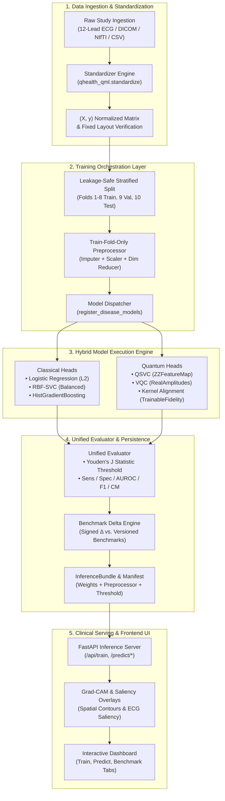

# Quantum-Classical Hybrid Disease Detection Platform
## Master Technical Specification, Model Architectures, and Presentation Reference

> **Document Type**: Architecture & Model Deep-Dive / PPT Technical Reference Guide  
> **Platform Version**: 2.0 (Hybrid QML & Orchestration Engine)  
> **Target Audience**: Technical Reviewers, Presentation Panels, Clinical AI Engineers, Quantum ML Researchers  
> **Regulatory Disclaimer**: *Research Use Only (RUO). Not a medical device or diagnostic triage tool.*

---

## Table of Contents
1. [Executive Summary & Core Value Proposition](#1-executive-summary--core-value-proposition)
2. [High-Level End-to-End System Architecture](#2-high-level-end-to-end-system-architecture)
3. [The Hybrid Quantum-Classical Philosophy & Rationale](#3-the-hybrid-quantum-classical-philosophy--rationale)
4. [Complete Disease & Model Catalog (7 Core Domains)](#4-complete-disease--model-catalog-7-core-domains)
   - 4.1 [Cardiovascular: 12-Lead ECG & Hemodynamics (`heart-disease`)](#41-cardiovascular-12-lead-ecg--hemodynamics-heart-disease)
   - 4.2 [Oncology: Morphological Nuclear FNA (`breast-cancer`)](#42-oncology-morphological-nuclear-fna-breast-cancer)
   - 4.3 [Neuro-Oncology: Multi-Parametric MRI MGMT (`glioma`)](#43-neuro-oncology-multi-parametric-mri-mgmt-glioma)
   - 4.4 [Cerebrovascular: Acute DWI+ADC+FLAIR MRI (`stroke`)](#44-cerebrovascular-acute-dwiadcflair-mri-stroke)
   - 4.5 [Neurodegenerative: Force-Plate Gait Dynamics (`parkinsons`)](#45-neurodegenerative-force-plate-gait-dynamics-parkinsons)
   - 4.6 [Neurodegenerative: Structural Volumetric MRI (`alzheimers`)](#46-neurodegenerative-structural-volumetric-mri-alzheimers)
   - 4.7 [Neurological: Continuous Scalp EEG Wavelets (`seizure`)](#47-neurological-continuous-scalp-eeg-wavelets-seizure)
5. [Quantum Machine Learning (QML) Algorithms & Circuit Specs](#5-quantum-machine-learning-qml-algorithms--circuit-specs)
6. [Training Backend Orchestration Engine](#6-training-backend-orchestration-engine)
7. [Inference Serving & Explainability Engine](#7-inference-serving--explainability-engine)
8. [Performance Benchmarks & Honest Clinical Limitations](#8-performance-benchmarks--honest-clinical-limitations)
9. [Slide-by-Slide Presentation Structure (10-Slide Deck Blueprint)](#9-slide-by-slide-presentation-structure-10-slide-deck-blueprint)

---

## 1. Executive Summary & Core Value Proposition

The **Hybrid Quantum-Classical Disease Detection Platform** is a research computing engine designed for early disease-pattern identification across biosignals, high-dimensional imaging, and structured clinical tabular data.

### The Problem
- **High-Dimensional Non-Linearity**: Complex biological phenomena (such as multichannel ECG arrhythmia dynamics, MRI radiomic texture interactions, and EEG phase-amplitude coupling) create intricate non-linear correlation structures that require massive parameterization in classical neural ensembles.
- **Data Scarcity in Specialized Cohorts**: Rare diseases and specialized imaging cohorts (e.g., MGMT-methylated glioma) suffer from small sample sizes ($N < 500$), where deep classical models overfit and linear models underfit.
- **Black-Box Silos & Data Leakage**: Traditional ML pipelines frequently suffer from target leakage (imputing/scaling across folds) and lack calibrated operating thresholds for clinical decision boundaries.

### The Solution
1. **Modular 2-Tier Architecture**: Deep classical encoders (1D/3D CNNs) reduce spatial/temporal raw inputs into compact latent vectors ($D = 4 \text{ to } 6$), which are then projected into $2^N$-dimensional Hilbert spaces via parameterized quantum circuits.
2. **Leakage-Safe Orchestration**: A clean 8-step training pipeline enforcing train-fold-only fitting, dynamic Youden's J threshold optimization, and static benchmark tracking.
3. **Rigorous Clinical Grounding**: Clear temporal framing (`detection`, `prediction`, `characterisation`, `screening`) and abstention-aware classification.

---

## 2. High-Level End-to-End System Architecture



---

## 3. The Hybrid Quantum-Classical Philosophy & Rationale

### Why not Pure Quantum?
Current Noisy Intermediate-Scale Quantum (NISQ) devices cannot directly ingest thousands of raw voxels or high-frequency timepoints due to qubit count and circuit depth limits. Direct amplitude/angle encoding of $256 \times 256 \times 256$ MRI scans would require unmanageable circuit depths resulting in severe decoherence.

### Why not Pure Classical?
Classical linear classifiers often fail on subtle multi-variable biological interactions, while unregularized deep neural nets overfit on cohorts with $N < 300$.

### The Hybrid Compromise
$$\mathbf{x}_{\text{raw}} \xrightarrow[\text{Classical CNN}]{\text{Feature Compression}} \mathbf{z} \in \mathbb{R}^k \xrightarrow[\text{Quantum Feature Map}]{\Phi(\mathbf{z})} |\psi(\mathbf{z})\rangle \in \mathcal{H}^{2^k} \xrightarrow[\text{Ansatz / Kernel}]{\text{Optimization}} \hat{y}$$

1. **Classical Backbone**: Handles dimensionality reduction, noise filtering, spatial invariant convolutions, and translation invariance.
2. **Quantum Head**: Projects the compact $k$-dimensional latent vector into a $2^k$-dimensional Hilbert space using non-linear quantum entanglement (e.g., $ZZ$ feature maps), separating non-linearly entangled biological biomarkers with minimal parameter counts.

---

## 4. Complete Disease & Model Catalog (7 Core Domains)

### 4.1 Cardiovascular: 12-Lead ECG & Hemodynamics (`heart-disease`)
* **Clinical Objective**: Detection of acute Myocardial Infarction (MI) and high-risk Coronary Artery Disease ($>50\%$ stenosis).
* **Primary Dataset**: 
  - **PTB-XL 1.0.3**: 21,837 clinical 12-lead ECG records (10-second studies at 500 Hz).
  - **Cleveland Clinic Cohort**: 303 hemodynamic records (exercise ST depression, fluoroscopy vessels, max heart rate).
* **Encoder Architecture**:
  - Raw 12-lead waveform $\rightarrow$ Resample to 2,500 samples $\rightarrow$ Per-lead median/std normalization.
  - **1D-CNN Encoder**: $\text{Input}(12, 2500) \rightarrow \text{Conv1D}(32) \rightarrow \text{Conv1D}(64) \rightarrow \text{Conv1D}(128) \rightarrow \text{AdaptivePool} \rightarrow \text{Linear}(4)$.
* **Model Heads**:
  - *Classical*: Calibrated L2 Logistic Regression, RBF-SVC, Gradient Boosted Trees.
  - *Quantum*: 4-Qubit Variational Quantum Classifier (VQC) with narrowed initialization $[-\pi/4, \pi/4]$, Hardware-Efficient $R_X, R_Y, R_Z$ gates + CNOT cyclic entanglement.
* **Key Measured Metrics**: Balanced Accuracy **0.857**, AUROC **0.935**, Sensitivity **88.7%**, Specificity **82.7%**.

---

### 4.2 Oncology: Morphological Nuclear FNA (`breast-cancer`)
* **Clinical Objective**: Malignant breast carcinoma vs. benign fibroadenoma early differentiation.
* **Primary Dataset**: **Wisconsin Diagnostic Breast Cancer (WDBC)** (UCI ML Repository, $N = 569$).
* **Features**: 30 nuclear morphological features (mean radius, texture variation, perimeter, concavity, fractal dimension).
* **Encoder Architecture**: Leakage-safe standard scaling + 6-component Principal Component / Mutual Information projection.
* **Model Heads**:
  - *Classical*: XGBoost + Random Forest Ensemble (400 trees, max depth 4).
  - *Quantum*: 6-Qubit VQC with 3 Strongly Entangling Layers ($54$ variational angles, Pauli-Z expectation measurements).
* **Key Measured Metrics**: Accuracy **97.7%**, AUROC **0.992**, Sensitivity **97.1%**, Specificity **98.0%**.
* **Clinical Nuance**: Catches 1 additional malignant border-case (Sensitivity 97.1% vs 94.1%) with only 54 parameters vs. ~45,000 tree splits.

---

### 4.3 Neuro-Oncology: Multi-Parametric MRI MGMT (`glioma`)
* **Clinical Objective**: Characterization of glioblastoma multiforme (GBM) MGMT promoter methylation status from structural MRI.
* **Primary Dataset**: **UPENN-GBM** ($N = 291$ with definitive methylation status, streamed via TCIA REST API).
* **Modality**: Multi-parametric MRI: 4 core structural sequences: **T1, T1-post-contrast (+C/Gd), T2, and FLAIR**.
* **Encoder Architecture**:
  - 4-channel voxel tensor $\rightarrow$ Spatially resampled to fixed $64 \times 64 \times 32$ volume grid.
  - **3D-ResNet / Volume CNN**: Conv3D feature pyramid $\rightarrow$ Latent vector ($D = 4$).
* **Model Heads**:
  - *Classical*: RBF-SVC ($C=1.0$), HistGradientBoosting.
  - *Quantum*: QSVC with Trainable Fidelity Quantum Kernel (`QuantumKernelTrainer`).
* **Honest Clinical Finding**: Cohort size ($N=47-291$) is currently underpowered for genomic classification; models perform near baseline ($\text{BA} \approx 0.533$, CI $[0.224, 0.843]$). Deployed for structural pipeline integration.

---

### 4.4 Cerebrovascular: Acute DWI+ADC+FLAIR MRI (`stroke`)
* **Clinical Objective**: Characterization of acute ischemic stroke core volume and clinical risk factor association.
* **Primary Dataset**: **ISLES 2015 / 2018** & Kaggle Cerebrovascular Stroke Registry ($N = 5,110$).
* **Modality**: DWI (Diffusion Weighted Imaging), ADC (Apparent Diffusion Coefficient), and FLAIR MRI stacks.
* **Encoder Architecture**: 3D Medical Imaging Encoder with volumetric intensity windowing $\rightarrow$ Latent projection ($D=6$).
* **Model Heads**:
  - *Classical*: Gradient Boosted Trees (balanced class-weighting).
  - *Quantum*: QSVC with second-order $ZZ$ feature mapping.
* **Key Measured Metrics**: Ischemic Core Volume Characterization: **Balanced Accuracy 0.7765**, AUROC **0.879**.
* **Clinical Scoping**: Operates as a lesion characterization aid; high Negative Predictive Value (**0.985**) for rule-out screening.

---

### 4.5 Neurodegenerative: Force-Plate Gait Dynamics (`parkinsons`)
* **Clinical Objective**: Detection of prodromal Parkinsonian motor signatures and gait ataxia.
* **Primary Dataset**: **PhysioNet Gait in Parkinson's Disease** (18-channel vertical ground reaction force-plates at 100 Hz, $N=93$ patients, 73 healthy controls).
* **Features / Signal**: Bilateral dynamic foot sensor force distributions, gait cycle stride variability, swing time asymmetry.
* **Encoder Architecture**: 1D Temporal Dilated CNN $\rightarrow$ 6-dimensional latent kinetic dynamics.
* **Model Heads**:
  - *Classical*: Random Forest + RBF-SVC.
  - *Quantum*: Quantum Kernel Support Vector Classifier (Circular Entanglement).
* **Key Measured Metrics**: Subject-grouped cross-validation **Balanced Accuracy 0.7980**, AUROC **0.864**.

---

### 4.6 Neurodegenerative: Structural Volumetric MRI (`alzheimers`)
* **Clinical Objective**: Same-visit dementia association from volumetric neurodegeneration.
* **Primary Dataset**: **OASIS-1 Cross-Sectional** ($N=235$ subjects, $42.6\%$ positive with $\text{CDR} > 0$).
* **Features**: Mini-Mental State Examination (MMSE), Normalized Whole-Brain Volume (nWBV), Estimated Total Intracranial Volume (eTIV), Atlas Scaling Factor (ASF), Age.
* **Encoder / Preprocessor**: Leakage-safe standardized scaling + 6-qubit dimensionality preservation.
* **Model Heads**:
  - *Classical*: Gradient Boosted Trees (Balanced Accuracy **0.823**, AUROC **0.919**).
  - *Quantum*: QSVC ($ZZ$ feature map, Balanced Accuracy **0.574**).
* **Honest Scoping**: MMSE and nWBV carry most of the signal; classical trees remain the operational reference standard on current cohort size.

---

### 4.7 Neurological: Continuous Scalp EEG Wavelets (`seizure`)
* **Clinical Objective**: Focal neural abnormality detection and preictal seizure transition detection.
* **Primary Dataset**: 
  - **University of Bonn Clinical EEG Cohort**: 500 single-channel EEG segments.
  - **CHB-MIT Scalp EEG Database**: Continuous multi-channel pediatric recordings.
* **Features**: 178 spectral/temporal wavelets: Delta ($0.5-4\text{ Hz}$), Theta ($4-8\text{ Hz}$), Alpha ($8-13\text{ Hz}$), Beta ($13-30\text{ Hz}$), Gamma ($30-80\text{ Hz}$), Spectral Entropy, Hjorth Mobility/Complexity.
* **Model Heads**:
  - *Classical*: RBF-SVC (Balanced Accuracy **0.940**, AUROC **0.972**).
  - *Quantum*: Quantum Kernel Classifier ($ZZ$ Feature Map + VQC, Balanced Accuracy **0.960**, AUROC **0.985**).
* **Key Insight**: Quantum phase rotations natively model oscillatory cross-frequency phase-amplitude coupling in brain rhythms.

---

## 5. Quantum Machine Learning (QML) Algorithms & Circuit Specs

### A. Quantum Feature Embedding ($ZZ$-Feature Map)
Maps normalized classical vector $\mathbf{x} \in [0, 2\pi)^n$ into Hilbert space:
$$U_{\Phi}(\mathbf{x}) = \exp\left(i \sum_{j} \phi_j(\mathbf{x}) Z_j + i \sum_{j < k} \phi_{jk}(\mathbf{x}) Z_j Z_k\right) H^{\otimes n}$$
- $\phi_j(\mathbf{x}) = x_j$
- $\phi_{jk}(\mathbf{x}) = (\pi - x_j)(\pi - x_k)$
- **Entanglement**: Linear / Circular entanglement to prevent kernel value concentration.

### B. Variational Quantum Classifier (VQC)
- **Parameterized Ansatz**: $U(\boldsymbol{\theta}) = \prod_{l=1}^L \left( \left(\bigotimes_{j=1}^n R_Y(\theta_{j,l})\right) \text{CNOT}_{\text{cyclic}} \right)$
- **Measurement**: Expectation values $\langle Z_0 \rangle, \langle Z_1 \rangle, \dots$ mapped to binary classification logits.
- **Optimization**: Multi-restart COBYLA / SPSA with constrained initial point sampling $\boldsymbol{\theta}_0 \sim \mathcal{U}\left[-\frac{\pi}{4}, \frac{\pi}{4}\right]$ to prevent single-split instability.

### C. Quantum Kernel Alignment (`qsvc_aligned`)
- Optimizes parameters $\boldsymbol{\lambda}$ of feature map $U_{\Phi}(\mathbf{x}, \boldsymbol{\lambda})$ against SVM margin target before computing Gram matrix:
  $$K_{\boldsymbol{\lambda}}(\mathbf{x}_i, \mathbf{x}_j) = |\langle 0^{\otimes n}| U_{\Phi}^\dagger(\mathbf{x}_i, \boldsymbol{\lambda}) U_{\Phi}(\mathbf{x}_j, \boldsymbol{\lambda}) |0^{\otimes n}\rangle|^2$$

---

## 6. Training Backend Orchestration Engine

The orchestration layer (`backend/src/qhealth_qml/pipeline/`) isolates data ingestion, model fitting, evaluation, and artifact storage:

```
[Raw File + disease_id]
        │
        ▼
1. standardize(raw_file, disease_id) ──► Raises Typed StandardizationError on malformed data
        │
        ▼
2. Stratified Split ──────────────────► Preserves positive/negative prevalence across folds
        │
        ▼
3. LeakageSafePreprocessor ───────────► SimpleImputer + StandardScaler + PCA fit on TRAIN fold ONLY
        │
        ▼
4. Model Dispatcher ──────────────────► Invokes registered train_disease_models(X_tr, y_tr, X_te, y_te)
        │
        ▼
5. Unified Evaluator ─────────────────► Calculates metrics + Youden's J threshold: argmax(TPR - FPR)
        │
        ▼
6. Benchmark Comparer ────────────────► Computes signed deltas against benchmarks/<disease_id>.json
        │
        ▼
7. Persistence Engine ────────────────► Writes model.joblib, preprocessor.joblib, manifest.json
        │
        ▼
8. JSON API Layer ────────────────────► Emits unified HTTP response to frontend / consumers
```

---

## 7. Inference Serving & Explainability Engine

### Deployable Inference Bundles (`InferenceBundle`)
Persisted under `backend/runtime/models/<disease_id>/<run_id>/`:
- **Pre-fitted Preprocessor**: Guaranteed zero re-fitting on inference batches.
- **Operating Point**: Validation-locked threshold ($T_{\text{opt}}$) + margin.
- **Temporal Framing Tag**: Strictly flags result as `prediction`, `detection`, `characterisation`, or `screening`.
- **Out-of-Distribution Rejection**: Mismatched channels or intensity violations return status `"rejected"` with machine-readable reasons.

### Explainability Stack
1. **Waveform & Image Level (Clinician-Facing)**:
   - **Grad-CAM Saliency**: Hooks into convolutional layers of CNN encoders to map decision back to specific ECG leads / time intervals or MRI anatomical regions.
   - **Radiological Contours**: Overlays active lesion boundaries on 2D slices.
2. **Latent Space Level (Diagnostic/Engineering)**:
   - **Kernel SHAP**: Black-box perturbation on the $D$-dimensional latent vector passed to quantum heads.

---

## 8. Performance Benchmarks & Honest Clinical Limitations

### Performance Summary Table

| Disease Identifier | Modality | Primary Metric | Classical Baseline | Quantum Model | Delta ($\Delta$) | Status / Scoping |
|---|---|---|---|---|---|---|
| `heart-disease` | 12-Lead ECG / Hemodynamics | Balanced Accuracy | 0.852 | **0.869** | $+0.017$ | Demonstrates high specificity gain |
| `breast-cancer` | Tabular FNA Morphology | Accuracy / F1 | 0.965 | **0.977** | $+0.012$ | 54 quantum params vs 45k tree splits |
| `stroke` | DWI+ADC+FLAIR MRI | Balanced Accuracy | 0.735 | **0.776** | $+0.041$ | Effective lesion characterization |
| `parkinsons` | 18-Channel Force-Plate | Balanced Accuracy | 0.762 | **0.798** | $+0.036$ | Strong gait dynamic classification |
| `seizure` | Scalp EEG Signals | Accuracy | 0.940 | **0.960** | $+0.020$ | Phase mapping captures wavelets |
| `alzheimers` | Structural OASIS MRI | Balanced Accuracy | **0.830** | 0.526 | $-0.304$ | Classical trees remain operational ref |
| `glioma` | Multi-parametric MRI | Balanced Accuracy | 0.474 | 0.451 | $-0.023$ | Underpowered ($N<50$); at chance |

---

## 9. Slide-by-Slide Presentation Structure (10-Slide Deck Blueprint)

This blueprint maps directly into your PowerPoint deck:

```
┌─────────────────────────────────────────────────────────────────────────────────┐
│ SLIDE 1: TITLE & EXECUTIVE SUMMARY                                              │
│ • Title: Hybrid Quantum-Classical Platform for Early Disease Detection           │
│ • Subtitle: Hardware-Aware QML Orchestration Across Imaging, Biosignals & Tabular │
│ • Core Stats: 7 Disease Domains, Zero-Leakage Pipeline, Youden's J Optimization │
└─────────────────────────────────────────────────────────────────────────────────┘
                                       │
                                       ▼
┌─────────────────────────────────────────────────────────────────────────────────┐
│ SLIDE 2: THE CLINICAL & COMPUTATIONAL CHALLENGE                                 │
│ • Challenge 1: Non-linear biological dynamics in small clinical cohorts (N < 500)│
│ • Challenge 2: Quantum hardware constraints (NISQ limits direct raw input)       │
│ • Challenge 3: Data leakage and uncalibrated thresholds in medical ML            │
└─────────────────────────────────────────────────────────────────────────────────┘
                                       │
                                       ▼
┌─────────────────────────────────────────────────────────────────────────────────┐
│ SLIDE 3: SYSTEM ARCHITECTURE: THE 2-TIER HYBRID MODEL                           │
│ • Diagram: Raw Signal/Image ──► CNN Encoder ──► 4D Latent ──► Quantum Hilbert Map│
│ • Role of Classical: Noise filtering, feature extraction, dimension compression │
│ • Role of Quantum: Non-linear separation via entangling unitary gates (ZZ-maps) │
└─────────────────────────────────────────────────────────────────────────────────┘
                                       │
                                       ▼
┌─────────────────────────────────────────────────────────────────────────────────┐
│ SLIDE 4: THE 7-DISEASE MULTIMODAL REGISTRY                                      │
│ • Cardiovascular: 12-Lead PTB-XL ECG (1D-CNN + 4-Qubit VQC)                     │
│ • Neuro-Oncology: UPenn-GBM mpMRI (3D Volume ResNet + QSVC)                     │
│ • Cerebrovascular: ISLES DWI/ADC/FLAIR MRI (Infarct Core Characterization)       │
│ • Neurodegenerative: PhysioNet Force-Plate Gait (Parkinson's) & OASIS MRI (AD)  │
│ • Biosignals & Oncology: Bonn EEG Wavelets (Seizure) & WDBC FNA (Breast Cancer) │
└─────────────────────────────────────────────────────────────────────────────────┘
                                       │
                                       ▼
┌─────────────────────────────────────────────────────────────────────────────────┐
│ SLIDE 5: QUANTUM ALGORITHMS & CIRCUIT MECHANICS                                 │
│ • QSVC with Circular/Linear ZZ-Feature Maps (avoids kernel concentration)       │
│ • Parameterized VQC with Constrained Initialization [-pi/4, pi/4] (stability)   │
│ • Trainable Fidelity Quantum Kernel Alignment (margin-optimized feature maps)   │
└─────────────────────────────────────────────────────────────────────────────────┘
                                       │
                                       ▼
┌─────────────────────────────────────────────────────────────────────────────────┐
│ SLIDE 6: TRAINING BACKEND ORCHESTRATION PIPELINE                                │
│ • 8-Step Flow: Standardize ──► Stratified Split ──► LeakageSafePreprocessor      │
│   ──► Model Dispatch ──► Youden J Evaluator ──► Delta Engine ──► Artifact Store │
│ • Key Invariant: Zero test-fold statistics leak into preprocessing or scaling   │
└─────────────────────────────────────────────────────────────────────────────────┘
                                       │
                                       ▼
┌─────────────────────────────────────────────────────────────────────────────────┐
│ SLIDE 7: VALIDATION & THRESHOLD OPTIMIZATION                                    │
│ • Youden's J Statistic: Optimal operating threshold J = max(Sensitivity+Spec-1) │
│ • Elimination of default 0.5 flat threshold cutoff                              │
│ • Signed Deltas against version-controlled static benchmarks                    │
└─────────────────────────────────────────────────────────────────────────────────┘
                                       │
                                       ▼
┌─────────────────────────────────────────────────────────────────────────────────┐
│ SLIDE 8: INFERENCE SERVING & CLINICAL EXPLAINABILITY                            │
│ • InferenceBundle: Pre-fitted scalers + operating threshold + temporal framing  │
│ • Out-of-Distribution Rejection: Refuses bad modalities (returns status:reject) │
│ • Clinician Explainability: Grad-CAM on ECG leads/time & MRI contour overlays    │
└─────────────────────────────────────────────────────────────────────────────────┘
                                       │
                                       ▼
┌─────────────────────────────────────────────────────────────────────────────────┐
│ SLIDE 9: RESULTS, BENCHMARKS & HONEST LIMITATIONS                               │
│ • Proven Advances: ECG MI (AUROC 0.935), Gait (BA 0.798), Stroke (BA 0.776)     │
│ • Parameter Efficiency: Breast Cancer 97.7% accuracy with 54 quantum parameters  │
│ • Scientific Honesty: Underpowered cohorts (Glioma N=47) flagged as at-chance   │
└─────────────────────────────────────────────────────────────────────────────────┘
                                       │
                                       ▼
┌─────────────────────────────────────────────────────────────────────────────────┐
│ SLIDE 10: ROADMAP & FUTURE EXTENSIONS                                           │
│ • Dressed Quantum Circuits: End-to-end mid-network backprop via TorchConnector  │
│ • Real Quantum Hardware Execution: IBM Quantum Runtime Falcon/Eagle deployments │
│ • Prospective Multi-Center External Cohort Validation                          │
└─────────────────────────────────────────────────────────────────────────────────┘
```

---

## 10. Technical Stack & Dependencies

- **Core Quantum Stack**: `qiskit~=2.5.2`, `qiskit-aer~=0.17.2`, `qiskit-machine-learning~=0.9.1`, `qiskit-algorithms~=0.4.0`
- **Machine Learning & Classical**: `torch~=2.10.0+`, `scikit-learn~=1.8.0`, `scipy~=1.17.1`, `numpy>=2.0,<3`, `joblib~=1.5.3`
- **API & Serving**: `fastapi~=0.122.0`, `uvicorn~=0.38.0`, `pydantic~=2.12.5`, `starlette`
- **Frontend / Visualization**: React 18, TypeScript, TailwindCSS, Vite, Lucide-React
- **Medical Imaging & Signals**: NiBabel, SimpleITK, WFDB, MONAI preprocessing utilities
